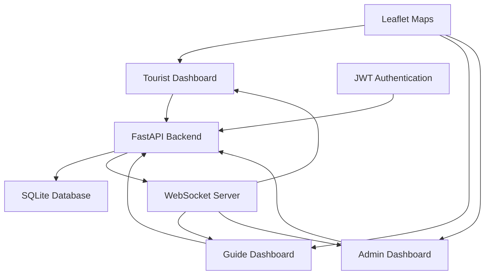

# 🛡️ Tourist Safety Net
## Smart Real-Time Tourist Safety Monitoring System

[](https://fastapi.tiangolo.com/)
[](https://python.org)
[](https://sqlalchemy.org)
[](https://developer.mozilla.org/en-US/docs/Web/API/WebSockets_API)

> **SIH 2025 Hackathon Project** - Problem Statement 2: Real-time monitoring of tourist safety at India's top heritage sites

---

## 🌟 **Overview**

Tourist Safety Net is an innovative **real-time safety monitoring system** designed to protect tourists visiting India's iconic heritage sites. The system provides **dynamic geofencing**, **live location tracking**, and **instant emergency alerts** to ensure tourist safety through cutting-edge technology.

### 🎯 **Key Features**

- 🗺️ **Real-time Location Tracking** - Live GPS monitoring of tourists and guides
- 🛡️ **Dynamic Safe Zones** - Adaptive safety circles that follow guide movement
- 🚨 **Instant Emergency Alerts** - Immediate notifications when tourists leave safe areas
- 👥 **Multi-Role Dashboard** - Separate interfaces for tourists, guides, and administrators
- 📱 **Responsive Design** - Beautiful, modern UI that works on all devices
- 🔐 **Secure Authentication** - JWT-based security with role-based access control
- ⚡ **WebSocket Integration** - Real-time updates without page refresh
- 🏛️ **Heritage Site Integration** - Pre-configured with India's top tourist destinations

---

## 🏗️ **Architecture**



---

## 🚀 **Quick Start**

### **Prerequisites**

- Python 3.13+
- pip (Python package manager)

### **Installation**

1. **Clone the repository**
   ```bash
   git clone https://github.com/yourusername/tourist-safety-net.git
   cd tourist-safety-net
   ```

2. **Create virtual environment**
   ```bash
   python -m venv venv
   
   # Windows
   venv\Scripts\activate
   
   # macOS/Linux
   source venv/bin/activate
   ```

3. **Install dependencies**
   ```bash
   pip install -r requirements.txt
   ```

4. **Run the application**
   ```bash
   python app.py
   ```

5. **Access the application**
   - Open your browser and go to `http://localhost:8000`
   - Use the demo credentials below to test different roles

---

## 👤 **Demo Accounts**

| Role | Email | Password | Description |
|------|-------|----------|-------------|
| **Admin** | `admin@demo.com` | `admin123` | Full system access, monitor all tourists |
| **Tourist** | `tourist@demo.com` | `tourist123` | Tourist dashboard with location controls |
| **Guide** | `guide@demo.com` | `guide123` | Guide dashboard with safe zone management |

---

## 🎮 **How to Use**

### **For Tourists**
1. **Login** with tourist credentials
2. **Select your destination** from the dropdown menu
3. **Use arrow keys or buttons** to simulate movement
4. **Monitor your safety status** - Green means safe, Red means critical
5. **Stay within safe zones** around available guides

### **For Guides**
1. **Login** with guide credentials
2. **View all tourists** in your area
3. **Move around** using arrow controls
4. **Monitor safe zones** - circles follow your movement
5. **Track tourist status** in real-time

### **For Administrators**
1. **Login** with admin credentials
2. **View all tourists** and their status
3. **Monitor the overview map** with all locations
4. **Track system-wide activity**

---

## 🛠️ **Technology Stack**

### **Backend**
- **FastAPI** - Modern, fast web framework for building APIs
- **SQLAlchemy** - Python SQL toolkit and ORM
- **Pydantic** - Data validation using Python type annotations
- **JWT** - JSON Web Tokens for secure authentication
- **WebSockets** - Real-time bidirectional communication

### **Frontend**
- **Bootstrap 5** - Responsive CSS framework
- **Leaflet.js** - Interactive maps
- **FontAwesome** - Beautiful icons
- **Jinja2** - Template engine

### **Database**
- **SQLite** - Lightweight, serverless database
- **AsyncPG** - High-performance PostgreSQL driver

---

## 📁 **Project Structure**

```
tourist-safety-net/
├── 📁 static/
│   ├── 📁 css/
│   │   ├── dashboard.css
│   │   └── map.css
│   └── 📁 js/
│       ├── dashboard.js
│       └── map.js
├── 📁 templates/
│   ├── dashboard.html          # Admin dashboard
│   ├── guide_dashboard.html    # Guide dashboard
│   ├── tourist_dashboard.html  # Tourist dashboard
│   ├── login.html              # Authentication page
│   ├── register.html           # Tourist registration
│   └── register_guide.html     # Guide registration
├── 📁 .vscode/
│   └── settings.json           # VS Code configuration
├── app.py                      # Main FastAPI application
├── auth.py                     # Authentication logic
├── models.py                   # Database models
├── requirements.txt            # Python dependencies
├── .eslintrc.js               # ESLint configuration
└── README.md                  # This file
```

---

## 🔧 **API Endpoints**

### **Authentication**
- `POST /auth/login` - User login
- `GET /auth/logout` - User logout
- `POST /register` - Tourist registration
- `POST /register-guide` - Guide registration

### **Dashboards**
- `GET /dashboard` - Admin dashboard
- `GET /guide-dashboard` - Guide dashboard
- `GET /tourist/{tourist_id}` - Individual tourist dashboard

### **API Endpoints**
- `GET /api/dashboard` - Admin data
- `GET /api/guide-dashboard` - Guide data
- `POST /change_tourist_location` - Change tourist location
- `GET /api/guide-positions` - Get guide positions
- `POST /update_location` - Update user location
- `WebSocket /ws/{user_id}` - Real-time updates

---

## 🎨 **Screenshots**

### **Admin Dashboard**


### **Guide Dashboard**


### **Tourist Dashboard**


---

## 🔒 **Security Features**

- **JWT Authentication** - Secure token-based authentication
- **Role-based Access Control** - Different permissions for different user types
- **Password Hashing** - Bcrypt encryption for stored passwords
- **Session Management** - Secure session handling
- **Input Validation** - Pydantic models for data validation

---

## 🌍 **Supported Heritage Sites**

- 🏛️ **Taj Mahal, Agra** - UNESCO World Heritage Site
- 🏰 **Red Fort, Delhi** - Historic fort complex
- 🌊 **Gateway of India, Mumbai** - Iconic arch monument
- 🏰 **Hawa Mahal, Jaipur** - Palace of Winds
- 🏛️ **Golden Temple, Amritsar** - Sacred Sikh shrine
- 🏛️ **India Gate, New Delhi** - War memorial
- 🏰 **Mysore Palace, Mysore** - Royal palace

---

## 🚀 **Future Enhancements**

- 🤖 **AI Risk Prediction** - Machine learning for safety assessment
- 📱 **Mobile App** - Native iOS/Android applications
- 🌐 **IoT Integration** - Smart sensors and beacons
- 📊 **Analytics Dashboard** - Advanced reporting and insights
- 🗣️ **Multi-language Support** - Support for regional languages
- 📍 **Offline Mode** - GPS tracking without internet

---

## 🤝 **Contributing**

We welcome contributions! Please follow these steps:

1. **Fork the repository**
2. **Create a feature branch** (`git checkout -b feature/amazing-feature`)
3. **Commit your changes** (`git commit -m 'Add amazing feature'`)
4. **Push to the branch** (`git push origin feature/amazing-feature`)
5. **Open a Pull Request**

---

## 📄 **License**

This project is licensed under the MIT License - see the [LICENSE](LICENSE) file for details.

---

## 👥 **Team**

- **Developer** - [Your Name](https://github.com/yourusername)
- **Mentor** - [Mentor Name](https://github.com/mentor)
- **Designer** - [Designer Name](https://github.com/designer)

---

## 📞 **Support**

- 📧 **Email** - support@touristsafetynet.com
- 🐛 **Issues** - [GitHub Issues](https://github.com/yourusername/tourist-safety-net/issues)
- 📖 **Documentation** - [Wiki](https://github.com/yourusername/tourist-safety-net/wiki)

---

## 🙏 **Acknowledgments**

- **SIH 2025** - Smart India Hackathon 2025
- **FastAPI** - For the amazing web framework
- **Leaflet** - For the interactive maps
- **Bootstrap** - For the responsive design
- **OpenStreetMap** - For the map data

---

<div align="center">

### 🌟 **Star this repository if you found it helpful!** 🌟

**Made with ❤️ for SIH 2025**

[](https://github.com/yourusername/tourist-safety-net)
[](https://github.com/yourusername/tourist-safety-net)

</div>
